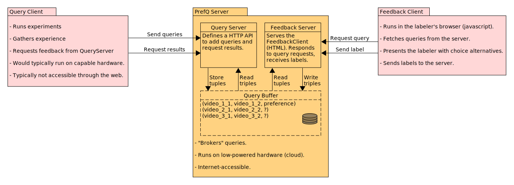

# prefq -- Querying Preferences from Real Humans

This project aims to provide an easy-to-use server-client interface for human feedback collection. For setting up your own server there's no requirement for previous knowledge about Cloud Hosting, Network Protocols, Flask etc. By following this guide, you will be able to host your own remotely accessible cloud server instance for remote human feedback collection within around 45 minutes, without the need of spending a single dollar.


## Architecture

This whole project follows a strict seperation of concerns, with 3 different instances.
1. **Query Client**: sends queries to Server & receives Feedback from Server
2. **Feedback Client**: receives queries from Server & sends Feedback to Server
3. **Server**: Receives queries, stores them locally & serves them, whenever requested. Only once all Feedback has been evaluated, returns the Feedback to the Query Client. 

Seperating the Query Client from the Server allows for more flexibility. For instance, you can send Queries to the server from your laptop, then disconnect from the web, and still serve videos to the Feedback Client. Additionally, the Query Client can generate videos and train the feedback model using any desired programming language. Lastly, this also allows us to run the server on minimal hardware requirements, e.g. a Raspberry Pi or a cloud computing free trial. Communication happens using an html-request interface.


## Set up your own PrefQ-Server

### Clone the repository & install poetry (package manager)
1. Clone the repository: `git clone https://github.com/timokau/prefq.git`
2. Install poetry: `curl -sSL https://install.python-poetry.org | python3 - `
3. Add poetry to PATH and make sure this persists across reboots. 
```bash
export PATH="$HOME/.local/bin:$PATH"
echo 'export PATH="$HOME/bin:$PATH"' >> ~/.bashrc
source ~/.bashrc
```

### Start your own PrefQ-Server

This server script's behavior is configurable using commandline arguments:

```
usage: server.py [-h] [--host HOST] [--port PORT] [--debug DEBUG]

options:
  -h, --help     show this help message and exit
  --host HOST    Specify the host (default: localhost)
  --port PORT    Specify the port (default: 5000)
  --debug DEBUG  Specify debug mode (default: False)
```

### Development Stage Server (local)

For a quick first impression - or if you'd like to adjust the server script to your individual needs - it is not necessary to host a remote server. Instead you can simply run the provided server script on localhost. Generally, it is possible to run a development server on the web, although not recommended.  More details [below](#additional-information-for-your-remote-server)

- Start a local server: `scripts/run_server.sh --debug True`

Using such a development server holds two eminent advantages:
1. Changes within your project folder will be recognized. As soon as you save changes, the server will reboot automatically and you can instantly test and verify new behavior.
2. Valuable debug information about incoming http-requests will be provided.

### Production Stage Server (remote)

For remote feedback collection it is recommended to run a development stage server. To do so you will need to specify your host IP and the port. Using the Broadcast-IP address `"0.0.0.0"` will allow incoming http requests from any IP address. Additionally, in the Internet Connection Protocol (ICP), Port 80 is commonly used as the default network port for sending and receiving unencrypted web pages. [[2]](https://www.techopedia.com/definition/15709/port-80), which might be what you are looking for.

This guide assumes, that you have preconfigured your local machine accordingly, and also possess the necessary rights to host a server inside your network. If this is not the case, you will find a guide for setting up a server on a cloud hosting platform below. The procedure for hosting a server on your own network is similar.

- Start a remote server: `scripts/run_server.sh --host 0.0.0.0 --port 80`

## Send Preference Queries to your Server (Query Client)

Both query client scripts are also configurable using commandline arguments:

```
usage: static_queries.py [-h] [--url URL]

options:
  -h, --help  show this help message and exit
  --url URL   Specify the server url (default: http://localhost:5000/)
```

Send queries to your server (assuming defaults):
1. Open a new terminal
2. *(a)* Send static queries: `scripts/run_static_queries.sh`
    *(b)* Send dynamic queries: `scripts/run_imitation_example.sh`


Option (a):
- shows the required http-request structure for sending queries & receiving feedback
- does not learn new behavior

Option (b):
- integrates our PrefQ-Server into [imitation](https://pypi.org/project/imitation/), a library based on [gymnasium](https://gymnasium.farama.org/index.html)
- capable of learning new behavior

### Feedback Client
Evaluate queries:
1. Visit the web interface provided under the server URL (assuming defaults): `http://localhost:5000` (*using your favorite web browser*)
2. Select your preferred video: use left/right arrow keys or click the corresponding button


### Additional information for your remote server 

Given that the Developement Server provided by Flask is "not designed to be particularly efficient, stable, or secure" [[1]](https://flask.palletsprojects.com/en/2.3.x/tutorial/deploy/) it is recommended to use a WSGI server instead.

Using `waitress.serve()` is a convenient way of launching a WSGI capable server within the script, without relying on a command line solution like gunicorn. If ease of use is your priority, then this is the way to go. However, for scaling up your application, using gunicorn, or [another WSGI tool](https://flask.palletsprojects.com/en/2.3.x/deploying/) might the better solution. That's because waitress uses a multithreaded model for its workers, while guinicorn treats each each worker as a seperate process. Either way, our provided PrefQ-Server is capable of handling both use-cases.

Now, for deploying your server and making it remotely accessible, there's countless different solutions. One convenient way is to use a Cloud Hosting platform. Within this guide we will provide an example for setting up a server using [Oracle Cloud Free Tier](https://www.oracle.com/cloud/free/?intcmp=ohp052322ocift). You will be able to collect Preference Feedback from multiple Feedback Clients, without any expenses. Setting up a server on using a different cloud hosting platform can be done similarly.

### Oracle Cloud Setup

1. Create an account on https://www.oracle.com/cloud/free/
2. Go to https://cloud.oracle.com/networking/
3. Select `start vcn wizard` &rarr; create vcn with internet connectivity
4. Type in a name for your server, then select next
5. Go to `Public Subnet` &rarr; `Default Security List` &rarr; `add ingress rules`
6. Specify:
`Source Type: "CIDR"`
`Source CIDR: "0.0.0.0/0"`
`IP Protocol: "TCP"`
`Port Range: 80`
`Description: "HTTP Port"`
7. Click `Generate SSH Key`, then download the key
8. go to `menu` &rarr; `compute` &rarr; `instances` &rarr; `create instance`
9. Specify instance name
10. Select desired system image (we use ubuntu 22.04)
11. Copy public IP address (`<your public ip address>`)
12. Open the console on your laptop, navigate to the folder with your SSH Key
13. Activate your key: `chmod 400 <yoursshkey>.key`
14. Connect to your server via ssh: `ssh -i <yoursshkey.key> ubuntu@<your public ip adress>`
15. You're now connected with your Oracle Cloud Server - log in as admin `sudo su`
16. `sudo apt update` &rarr; `sudo apt upgrade` &rarr; `sudo apt install git`
18. Allow incoming http traffic on port 80: `sudo iptables -A INPUT -p tcp --dport 80 -j ACCEPT`
19. Allow http traffic on your firewall:
	```bash
	sudo apt install firewalld
	firewall-cmd --add-service=http --permanent
	```
21. Start the Server as described in the previous chapter
22. From your local machine send videos to your server: `scripts/run_static_queries.sh --url http://<your-public-IP>:80`


## Contributing

This project uses [pre-commit](https://pre-commit.com/) for initial quality and consistency checks. To run these checks on each commit.

1. install poetry: `curl -sSL https://install.python-poetry.org | python3 -`
2. install pre-commit checks: `poetry run pre-commit install`

For automatic code formatting according to these consistency checks you can use black in combination with pylint. This will ease your workflow, as your code will be adjusted automatically, instead of formatting everything manually. 

1. `pip install pylint`
2. `pip install black`

Whenever you run `git commit`, pylint and black will attempt to [reformat](https://black.readthedocs.io/en/stable/the_black_code_style/current_style.html) your code on all staged changes. If changes are made you can just save the formatted file(s) and run `git add <formatted files>`.
